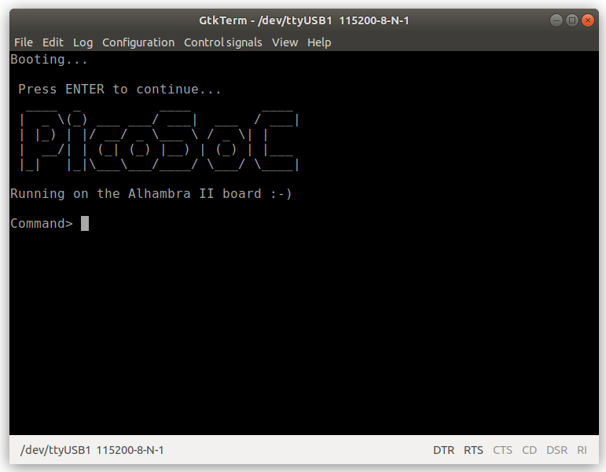

# RISC-V-FPGA
  RISC-V CPU for OpenFPGAs, in Icestudio


## Quick start

* Open the **soc-demo.ice** file with Icestudio (5.0 or higher)
* Connect the Alhambra-II board (or compatible) and upload the design
* It will take around 6min to sinthesize and upload to the board
* The system is ready for executing your firmware!

### Testing the firmaware in C

* go to the firmware/soc-demo/src-c folder
* Execute make (It is assumed that you already have the risc-v tools installed)
* You should see a binary counter in the LEDs
* If you open a serial terminal (115200 bauds) you will see messages



* In this [youtube video](https://www.youtube.com/watch?v=mv1SFoqzZWY) you can see it in action!


* Pressing the "1" key will reset the counter and show the intial message again


### Testing the firmware in asm

* go to the firmware/soc-demo/src-asm folder
* Execute make
* You should see a value in the LEDs

## Credits

It is based on the picorv32 by Clifford Wolf
https://github.com/cliffordwolf/picorv32

## SOCs for the RARs simulator

There are two socs for using with the RARs simulador:
* soc-rars-MMIO-1-port.ice: It have no uart and 1 output port at address 0xFFFF0000, connected to the LEDs
* soc-rars-MMIO-2-ports.ice: The previous soc plus one additional output port, connected to the D0-D7 pins in the Alhambra II board

In the firmware/soc-rars-MMIO-1/rars folder there are examples for trying. Open them with the RARs simulator, assemble and dump the code into a .bin file. Then flash it into the FPGA with iceprog tool:

```
iceprog -o 1M file.bin
```
